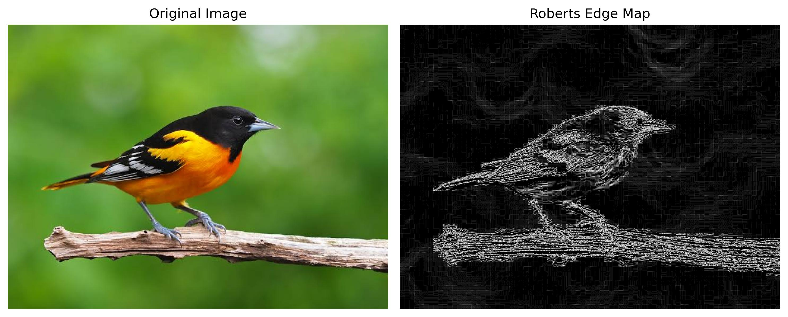
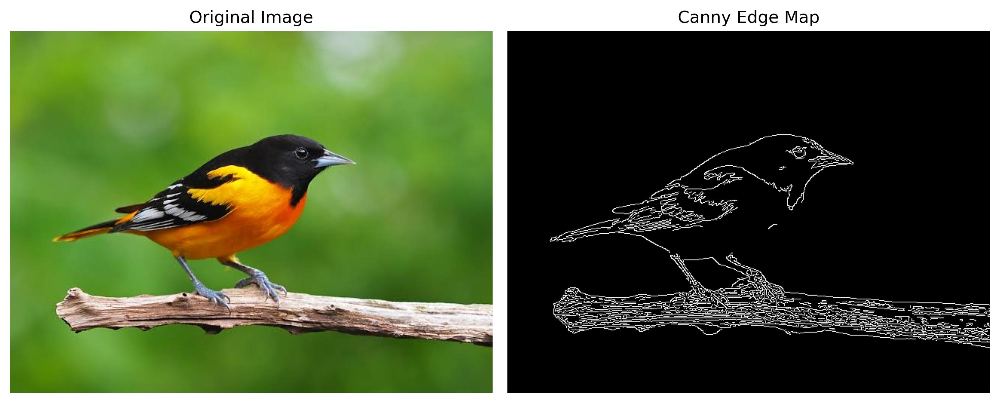
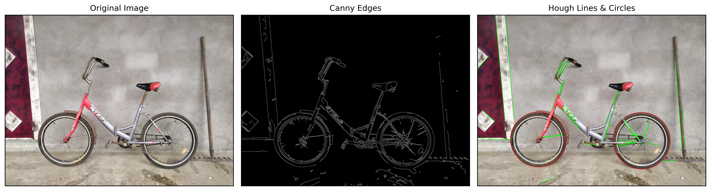
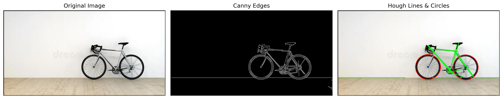
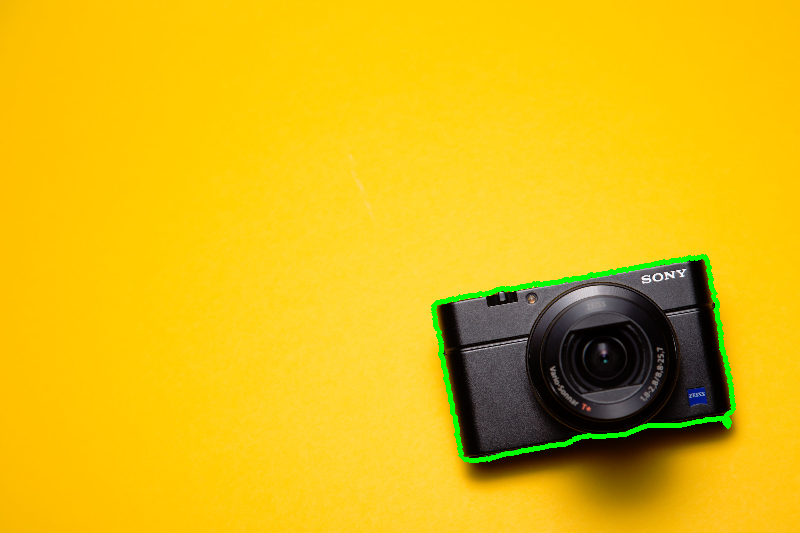
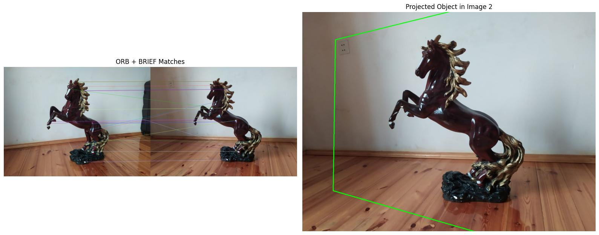

# Assignment 4

This repository contains the source code and images for Assignment 4.

## Structure
  - `images`The folder consists of images from both internet and my own, make sure it is in the same folder with other scripts.
  - `outputs` contains the results of functions seperately, so that the user doesn't have to crop it from plots
  - `utils.py` Contains the filter and image processing functions
  - `task1-plot-outputs`,`task2-plot-outputs`, ... contain the images for the report of my work.
  - the other scripts are for assignments.

## Assignments 

- [Part 1](#part-1)
- [Part 2](#part-2)
- [Part 3](#part-3)
- [Part 4](#part-1)
- [How to run](#how-to-run)
---
For all of the functions, I have designed so that the user may only pick the index and doesn't have to worry about image naming for avoiding complexity. However, if the user wish, they can change the name of input images ( e.g. an image from local file) and output images.
---
## Part 1
The first part applies 5 different edge detection algorithms, from my point of view, the best one is canny-edge detection and the worst one is Robert-edge detection system.

###  Robert-edge detection
<p>
  
</p>
As we see, the image is very blurry.
###  Canny-edge detection
<p>
  
</p>
The Canny-edge detection algorithm clearly detects edges without any noise, best one for the first task.

---

## Part 2
Here, I have taken a picture of my own bike, which seems bigger than the one I took from the internet.
It turns out that, Hough transform is very sensitive to the parameters, such as the minimum and maximum radius, the minimum distance between detected shapes, etc for circles. On line detection, if the length is not long enough, it detects almost everything as a line(even smooth curves). I have included two different parameters for kernel size and min-max radiuses.

Here the image is very noisy, so a biger kernel size is needed (such as 7). The radius of the wheels of the bicycle is also bigger, so I have adjusted the parameters as follows:
```
kernel, min_rad, max_rad = 7,190,200  # for image 1
```
###  My image
<p>
  
</p>

The background of the image is very smooth, so a smaller gaussian kernel is just fine, the radius of the bicycle is much smaller, so:

```
kernel, min_rad, max_rad = 5,40,60   # for image 2
```
###  Image from internet source
<p>
  
</p>

---

## Part 3
We have used star algorithm for active-conour detections, you draw a borderline and press space after you finish, or you can reset it by pressing R. When you close the window, the program saves the image if you wish, if no contour detected, it will report it to you.

###  Snake algorithm 
<p>
  
</p>


---

## Part 4
I have `pairs` folder, which contains images of pairs for this assignment, and you pick an index for pair folder. The first image is from the slides and it should detect the guitar. The second pair consists of a bicycle and a camera, and it should fail. The last image is an image of a small horse from two differen angles (approximately 20 percent and 90 percent), and the algorithm manages to detect that it is same type of object.The script loads two images, detects keypoints with ORB, matches them using Lowe’s ratio test, and estimates a homography if enough good matches are found. It then projects the first image onto the second to localize the object, visualizes the result, and optionally saves the outputs.
###  Snake algorithm on camera
<p>
  
</p>


---
## How to run

~~~
git clone https://github.com/ADA-GWU/a4-feature-extraction-aghayevagha.git
cd a4-feature-extraction-aghayevagha
~~~

Install the necessary libraries
~~~
pip install opencv-python numpy matplotlib scikit-image scikit-learn  scipy
~~~
  - run `as1.py`, `as2.py`, `as3.py`, `as3.py` for corresponding parts of the assignments, example:
~~~
python as1.py
~~~
